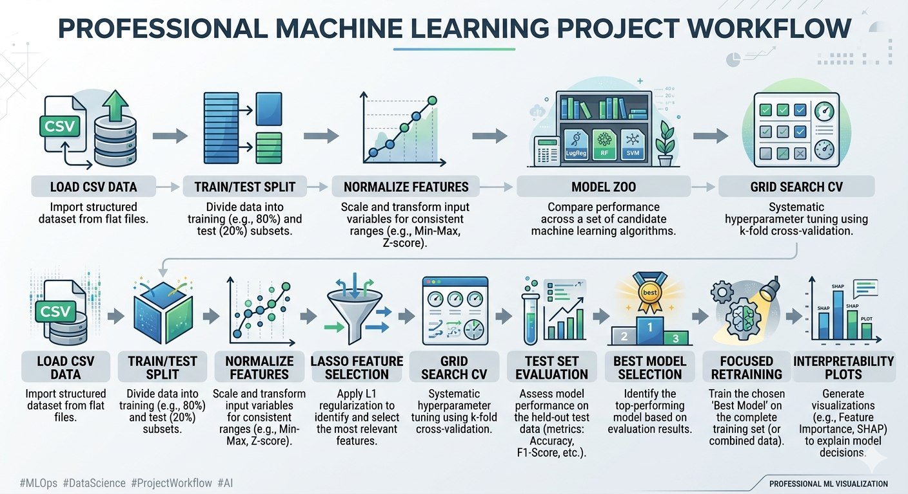
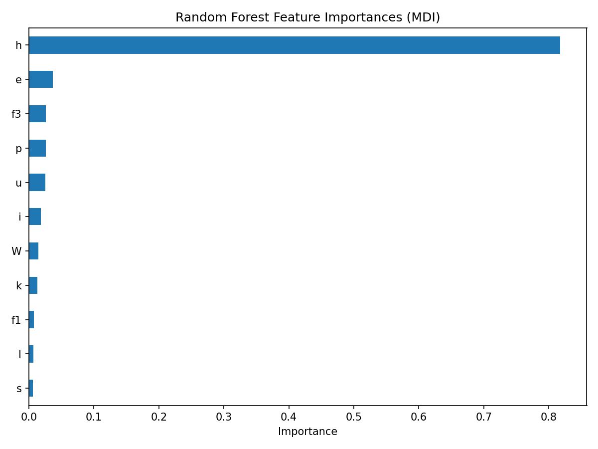
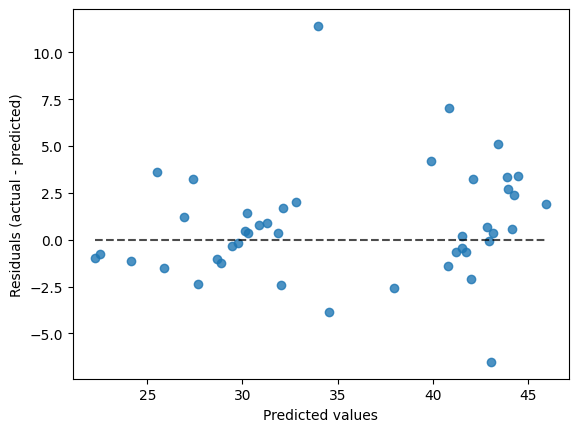
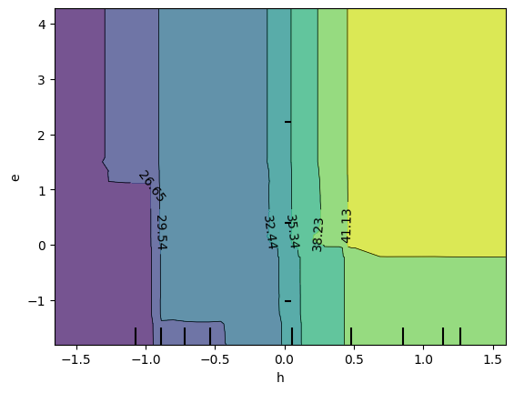

# CMJ_ML_Prediction

> A second-year undergraduate freelance Machine Learning project for predicting Countermovement Jump (CMJ) performance from biomechanical features.

[](https://www.python.org/)
[](https://scikit-learn.org/)
[](.)

## Project Overview

This repository implements a full supervised regression workflow to predict jump outcome (`y`) using engineered kinematic/biomechanical variables.

The pipeline combines:

- 📥 data preprocessing aligned with the reference study
- 🧠 feature selection using Lasso
- ⚙️ hyperparameter optimization through Grid Search + Cross-Validation
- 📊 multi-model benchmarking and detailed error analysis
- 🌲 focused tuning of a best-performing estimator (Random Forest)
- 📈 diagnostic visualizations (learning curve, validation curve, feature importance, PDP, residuals)

## Visual Gallery







## Methodology

### 1. Preprocess the Data (Study-Aligned)

1. Load data from CSV and extract input features.
2. Split dataset into Train/Test (`75% / 25%`).
3. Normalize train features: subtract mean, divide by standard deviation.
4. Normalize test features using train statistics only.

### 2. Lasso Feature Selection

- Use Lasso (L1 regularization) to enforce sparsity.
- Features with near-zero coefficients are removed.
- Reduced feature space is used by all downstream regressors.

### 3. Grid Search + Cross-Validation (Our Contribution)

- Define multiple candidate regressors.
- Tune model-specific hyperparameters with `GridSearchCV`.
- Evaluate via cross-validation using metrics such as MAE, MSE, and `R²`.

### 4. Train Multiple Regression Models (Our Contribution)

Models explored include:

- MLP Regressor
- Random Forest Regressor
- Gradient Boosting Regressor
- SVR
- Linear Regression
- Ridge
- ElasticNet
- LassoLars
- Bayesian Ridge
- Tweedie Regressor
- SGD Regressor

### 5. Model Evaluation (Study + Our Contribution)

Each model is evaluated on the held-out test set with:

- Bias and confidence bounds
- MAE and dispersion
- RMSE
- `R²`
- MAPE
- Kendall's tau between prediction center and absolute error

### 6. Best-Model Focused Training (Our Contribution)

After benchmarking, the selected estimator is trained with an extended search space for improved performance and interpretability.

### 7. Graphs and Diagnostics (Our Contribution)

The notebook and scripts provide:

- Validation Curves
- Learning Curves
- Impurity-based and Permutation Feature Importance
- Correlation clustering / multicollinearity analysis
- Prediction Error Display
- Partial Dependence Plots (1-way and 2-way)

## Workflow Diagram


## Repository Structure

```text
.
|-- Best_Model.py
|-- Final.py
|-- Graphs.py
|-- scripts/
|   |-- train_all_models.py
|   |-- train_random_forest.py
|   `-- analyze_random_forest.py
|-- src/jump_regressor/
|   |-- config.py
|   |-- data.py
|   |-- feature_selection.py
|   |-- metrics.py
|   |-- models.py
|   |-- plotting.py
|   `-- training.py
|-- data/
|   |-- processed/features_round.csv
|   `-- raw/
|       |-- db (1).csv
|       `-- db2.csv
|-- notebooks/
|   `-- Graphs_MLP.ipynb
|-- outputs/
|   |-- figures/
|   `-- models/
|-- assets/
|   `-- screenshots/
|-- requirements.txt
`-- .gitignore
```

## Setup

```bash
pip install -r requirements.txt
```

## Run

Train and benchmark all models:

```bash
python Best_Model.py
```

Train and tune Random Forest with extended grid:

```bash
python Final.py
```

Run analysis/plot script:

```bash
python Graphs.py
```

## Current Output Artifacts

- Saved models: `outputs/models/*_Final.sav`
- Saved figures: `outputs/figures/*.png`

## Reproducibility Notes

- Fixed random seed (`random_state = 42`) is used across major training steps.
- Test normalization always uses train-set statistics.
- Legacy top-level scripts (`Best_Model.py`, `Final.py`, `Graphs.py`) are preserved as compatibility wrappers to the modular implementation.

## Author

**Nektarios-I**  
Freelance ML project (Undergraduate, Year 2)

